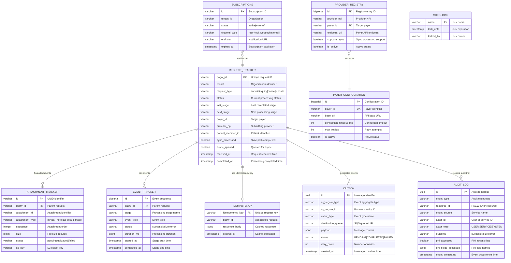

# PAGW Operational Data Model

> **Comprehensive guide to PAGW database architecture, real-time monitoring, and operational queries**

---

## Table of Contents

1. [Overview](#overview)
2. [Entity Relationship Diagram](#entity-relationship-diagram)
3. [Core Tables](#core-tables)
4. [Table Definitions](#table-definitions)
5. [Real-Time Monitoring Queries](#real-time-monitoring-queries)
6. [Operational Use Cases](#operational-use-cases)
7. [Performance Considerations](#performance-considerations)

---

## Overview

The PAGW operational data model supports:
- **Request Lifecycle Tracking** - End-to-end PA request processing
- **Event-Driven Architecture** - Transactional outbox pattern for reliable messaging
- **HIPAA Compliance** - PHI access audit trail
- **Real-Time Monitoring** - Status tracking and operational dashboards
- **Multi-Tenancy** - Organization isolation
- **High Availability** - Distributed locking and idempotency

**Database**: PostgreSQL 15+ (Aurora compatible)  
**Schema**: `pagw`  
**Migration Tool**: Flyway  

---

## Entity Relationship Diagram



---

## Core Tables

### High-Level Summary

| Table | Purpose | Update Frequency | Query Pattern |
|-------|---------|------------------|---------------|
| **request_tracker** | Request lifecycle state machine | High (per stage) | By pagw_id, status, tenant |
| **outbox** | Transactional message queue | Very High | Polling by status |
| **attachment_tracker** | Attachment processing status | Medium | By pagw_id, status |
| **event_tracker** | Stage-level event history | High | By pagw_id, stage |
| **audit_log** | HIPAA compliance audit trail | Very High | By resource_id, timestamp |
| **provider_registry** | Provider→Payer routing | Low (config changes) | By provider_npi, payer_id |
| **payer_configuration** | Payer API settings | Low (config changes) | By payer_id |
| **idempotency** | Duplicate prevention cache | High | By idempotency_key |
| **subscriptions** | FHIR notification subscriptions | Low | By tenant_id, status |
| **shedlock** | Distributed task locking | High (background jobs) | By name |

---

## Table Definitions

### 1. REQUEST_TRACKER (Core State Machine)

**Purpose**: Central table tracking every PA request from submission to completion through all processing stages.

#### Key Columns

| Column | Type | Purpose | Example |
|--------|------|---------|---------|
| `pagw_id` | VARCHAR(50) PK | Unique request identifier | `PAGW-20251223-ABC123` |
| `tenant` | VARCHAR(100) | Multi-tenant organization ID | `anthem-ca`, `elevance-ny` |
| `source_system` | VARCHAR(50) | Originating system | `epic`, `cerner`, `api` |
| `request_type` | VARCHAR(20) | Da Vinci PAS operation | `submit`, `inquiry`, `cancel`, `update` |
| `idempotency_key` | VARCHAR(255) | Duplicate detection key | Bundle.identifier UUID |
| `correlation_id` | VARCHAR(100) | Cross-system tracing | UUID from X-Correlation-Id |
| `status` | VARCHAR(30) | Current processing state | See [Status Values](#status-values) |
| `last_stage` | VARCHAR(50) | Last completed pipeline stage | `business_validator` |
| `next_stage` | VARCHAR(50) | Next stage to execute | `request_enricher` |
| `workflow_id` | VARCHAR(100) | Workflow instance tracking | UUID for orchestration |
| `last_error_code` | VARCHAR(50) | Error code from last failure | `VAL_001`, `PAYER_TIMEOUT` |
| `last_error_msg` | TEXT | Human-readable error description | `Invalid FHIR Bundle structure` |
| `retry_count` | INT | Number of retry attempts | 0-5 (max_retries) |
| `raw_s3_bucket` | VARCHAR(255) | Original FHIR bundle storage | `pagw-request-dev` |
| `raw_s3_key` | VARCHAR(500) | S3 object path | `202512/PAGW-123/raw/bundle.json` |
| `enriched_s3_bucket` | VARCHAR(255) | Enriched data storage | `pagw-request-dev` |
| `enriched_s3_key` | VARCHAR(500) | Enriched FHIR path | `202512/PAGW-123/enriched/bundle.json` |
| `final_s3_bucket` | VARCHAR(255) | Response/X12 storage | `pagw-request-dev` |
| `final_s3_key` | VARCHAR(500) | Final output path | `202512/PAGW-123/final/response.json` |
| `external_request_id` | VARCHAR(100) | Payer's tracking ID | `AUTH-67890` (preAuthRef) |
| `external_reference_id` | VARCHAR(100) | External system reference | Provider EHR claim ID |
| `payer_id` | VARCHAR(50) | Target payer identifier | `CARELON`, `ANTHEM` |
| `provider_npi` | VARCHAR(20) | Submitting provider NPI | `1234567890` |
| `patient_member_id` | VARCHAR(100) | Patient/member identifier | Encrypted member ID |
| `client_id` | VARCHAR(100) | OAuth client identifier | `epic-prod-client` |
| `member_id` | VARCHAR(100) | Member lookup key | For enrichment lookups |
| `provider_id` | VARCHAR(100) | Provider lookup key | For enrichment lookups |
| `contains_phi` | BOOLEAN | PHI present in request | `true` (almost always) |
| `phi_encrypted` | BOOLEAN | PHI encrypted with KMS | `true` for field-level encryption |
| `sync_processed` | BOOLEAN | Synchronous path completed | `true` = immediate response sent |
| `sync_processed_at` | TIMESTAMP | Sync completion time | Used for SLA tracking |
| `async_queued` | BOOLEAN | Queued for async processing | `true` = queued to SQS |
| `async_queued_at` | TIMESTAMP | Queue time | For async path tracking |
| `received_at` | TIMESTAMP | Initial receipt timestamp | Request arrival time |
| `completed_at` | TIMESTAMP | Processing completion | Final status time |
| `callback_sent_at` | TIMESTAMP | Provider notification sent | For pended requests |
| `expires_at` | TIMESTAMP | Request expiration | For cache/idempotency cleanup |
| `created_at` | TIMESTAMP | Record creation | Auto-populated |
| `updated_at` | TIMESTAMP | Last modification | Auto-updated by trigger |

#### Status Values

| Status | Meaning | Terminal | Description |
|--------|---------|----------|-------------|
| `received` | Initial state | No | Request received by orchestrator |
| `parsing` | In progress | No | FHIR bundle parsing |
| `validating` | In progress | No | Business rules validation |
| `enriching` | In progress | No | Member/provider data enrichment |
| `processing_attachments` | In progress | No | Attachment upload/processing |
| `converting` | In progress | No | FHIR to X12 278 conversion |
| `submitting_to_payer` | In progress | No | External payer API call |
| `building_response` | In progress | No | ClaimResponse construction |
| `pended` | Waiting | No | Awaiting manual review/decision |
| `approved` | Success | Yes | Prior authorization approved |
| `denied` | Success | Yes | Prior authorization denied |
| `partial_approved` | Success | Yes | Partial approval |
| `cancelled` | Success | Yes | Request cancelled by provider |
| `failed` | Error | Yes | Unrecoverable error |
| `timeout` | Error | Yes | Processing timeout exceeded |

#### Indexes

```sql
idx_request_tracker_status        -- Dashboard queries by status
idx_request_tracker_tenant        -- Multi-tenancy isolation
idx_request_tracker_idempotency   -- Duplicate detection
idx_request_tracker_external_id   -- Payer reference lookups
idx_request_tracker_patient       -- Patient inquiry
idx_request_tracker_created       -- Time-based reporting
idx_request_tracker_received      -- SLA tracking
```

---

### 2. OUTBOX (Transactional Outbox Pattern)

**Purpose**: Ensures reliable message publishing to SQS queues using the transactional outbox pattern. Messages are written in the same database transaction as business data, then published asynchronously by the outboxpublisher service.

#### Key Columns

| Column | Type | Purpose | Example |
|--------|------|---------|---------|
| `id` | UUID PK | Message identifier | UUID v4 |
| `aggregate_type` | VARCHAR(100) | Business entity type | `REQUEST_TRACKER`, `ATTACHMENT` |
| `aggregate_id` | VARCHAR(100) | Business entity ID | pagw_id value |
| `event_type` | VARCHAR(100) | Event name | `RequestReceived`, `ValidationComplete` |
| `destination_queue` | VARCHAR(500) | Full SQS queue URL | `https://sqs.us-east-1.amazonaws.com/...` |
| `payload` | JSONB | Message content | Complete SQS message body |
| `status` | VARCHAR(20) | Processing status | `PENDING`, `COMPLETED`, `FAILED` |
| `retry_count` | INT | Retry attempts | 0-5 |
| `max_retries` | INT | Maximum retries | 5 (default) |
| `last_error` | TEXT | Last failure message | SQS publish error details |
| `created_at` | TIMESTAMP | Message creation | Transactional timestamp |
| `processed_at` | TIMESTAMP | Publish completion | NULL if pending |
| `next_retry_at` | TIMESTAMP | Next retry time | Exponential backoff calculation |

#### Message Lifecycle

```
1. Business transaction writes to request_tracker + outbox (atomic)
2. COMMIT
3. Outboxpublisher polls outbox WHERE status='PENDING'
4. Publish to SQS
5. Update status='COMPLETED', processed_at=NOW()
```

#### Indexes

```sql
idx_outbox_pending    -- WHERE status='PENDING' (polling optimization)
idx_outbox_retry      -- WHERE status='PENDING' AND retry_count > 0
```

---

### 3. ATTACHMENT_TRACKER

**Purpose**: Track individual attachments (clinical notes, lab results, images) through upload and processing stages.

#### Key Columns

| Column | Type | Purpose | Example |
|--------|------|---------|---------|
| `id` | VARCHAR(100) PK | UUID identifier (V003 migration) | UUID string |
| `pagw_id` | VARCHAR(50) FK | Parent request | `PAGW-20251223-ABC123` |
| `attachment_id` | VARCHAR(100) | FHIR attachment ID | From FHIR Bundle |
| `attachment_type` | VARCHAR(50) | Clinical document type | `clinical_note`, `lab_result`, `image` |
| `sequence` | INTEGER | Order in claim | 1, 2, 3... (V003 migration) |
| `original_filename` | VARCHAR(255) | Original file name | `lab_results_2025.pdf` |
| `content_type` | VARCHAR(100) | MIME type | `application/pdf`, `image/jpeg` |
| `size` | BIGINT | File size in bytes | 1048576 (V003 renamed from file_size_bytes) |
| `checksum` | VARCHAR(64) | SHA-256 checksum | For integrity verification (V003) |
| `s3_bucket` | VARCHAR(255) | Storage bucket | `pagw-attachments-dev` |
| `s3_key` | VARCHAR(500) | S3 object key | `202512/PAGW-123/attachments/1.pdf` |
| `status` | VARCHAR(30) | Processing status | `pending`, `uploaded`, `processed`, `failed` |
| `error_message` | TEXT | Failure details | Upload/processing errors |
| `created_at` | TIMESTAMP | Record creation | |
| `processed_at` | TIMESTAMP | Processing completion | |

#### Indexes

```sql
idx_attachment_tracker_pagw       -- Join with request_tracker
idx_attachment_tracker_status     -- Status monitoring
idx_attachment_tracker_sequence   -- Ordered retrieval
```

---

### 4. EVENT_TRACKER

**Purpose**: Record every processing stage execution for detailed request history and debugging.

#### Key Columns

| Column | Type | Purpose | Example |
|--------|------|---------|---------|
| `id` | BIGSERIAL PK | Event sequence | Auto-increment |
| `pagw_id` | VARCHAR(50) FK | Parent request | `PAGW-20251223-ABC123` |
| `stage` | VARCHAR(50) | Pipeline stage | `request_parser`, `business_validator` |
| `event_type` | VARCHAR(50) | Event classification | `STAGE_START`, `STAGE_COMPLETE`, `ERROR` |
| `status` | VARCHAR(30) | Execution outcome | `success`, `failure`, `error` |
| `external_reference` | VARCHAR(100) | External system ref | Payer response ID |
| `duration_ms` | BIGINT | Processing time | Milliseconds |
| `error_code` | VARCHAR(50) | Error identifier | `VAL_001`, `TIMEOUT` |
| `error_message` | TEXT | Error details | Stack trace excerpt |
| `started_at` | TIMESTAMP | Stage start time | |
| `completed_at` | TIMESTAMP | Stage end time | |
| `created_at` | TIMESTAMP | Record creation | |

#### Pipeline Stages

- `orchestrator` - Request receipt and routing
- `request_parser` - FHIR bundle parsing
- `business_validator` - Business rules validation
- `request_enricher` - Member/provider data enrichment
- `attachment_handler` - Attachment processing
- `canonical_mapper` - FHIR to X12 conversion
- `api_orchestrator` - Payer API call orchestration
- `response_builder` - ClaimResponse construction
- `callback_handler` - Provider notification

#### Indexes

```sql
idx_event_tracker_pagw     -- Request history queries
idx_event_tracker_stage    -- Stage-level analytics
```

---

### 5. AUDIT_LOG (HIPAA Compliance)

**Purpose**: Maintain HIPAA-compliant audit trail for PHI access and system events. **NO PHI STORED** - only metadata and access tracking.

#### Key Columns (Post V002 Migration)

| Column | Type | Purpose | Example |
|--------|------|---------|---------|
| `id` | UUID PK | Audit record identifier | UUID v4 |
| `event_type` | VARCHAR(50) | Audit event category | `PHI_ACCESS`, `REQUEST_SUBMIT`, `AUTH_FAILURE` |
| `event_timestamp` | TIMESTAMP | Event occurrence time | Indexed for time-series queries |
| `resource_id` | VARCHAR(50) | Resource identifier | pagw_id or other resource ID |
| `correlation_id` | VARCHAR(100) | Request tracing | X-Correlation-Id header |
| `tenant` | VARCHAR(100) | Organization context | For multi-tenant isolation |
| `event_source` | VARCHAR(50) | Service name | `pasorchestrator`, `pasrequestenricher` |
| `actor_id` | VARCHAR(100) | User or service ID | User email or OAuth client_id |
| `actor_type` | VARCHAR(20) | Actor classification | `USER`, `SERVICE`, `SYSTEM` |
| `actor_ip` | VARCHAR(50) | Source IP address | Required for HIPAA access logs |
| `trace_id` | VARCHAR(100) | Distributed tracing ID | OpenTelemetry trace ID |
| `request_path` | VARCHAR(500) | API endpoint accessed | `/api/v1/pas/submit` |
| `resource_type` | VARCHAR(50) | Resource type | `CLAIM`, `MEMBER`, `PROVIDER` |
| `action_description` | TEXT | Action performed | `Submit prior authorization request` |
| `outcome` | VARCHAR(20) | Result | `success`, `failure`, `error` |
| `error_code` | VARCHAR(50) | Error identifier | For failure analysis |
| `phi_accessed` | BOOLEAN | PHI access flag | `true` triggers HIPAA logging |
| `phi_fields_accessed` | TEXT[] | PHI field names | `['patient.name', 'patient.ssn']` |
| `access_reason` | VARCHAR(500) | Business justification | Required for HIPAA compliance |
| `metadata` | JSONB | Additional context | Non-PHI structured data |
| `created_at` | TIMESTAMP | Record creation | Auto-populated |

#### Audit Event Types

| Event Type | Description | PHI Risk |
|------------|-------------|----------|
| `PHI_ACCESS` | PHI data retrieved | High |
| `REQUEST_SUBMIT` | PA request submitted | High |
| `REQUEST_QUERY` | Status inquiry | Low |
| `AUTH_SUCCESS` | Authentication success | Low |
| `AUTH_FAILURE` | Authentication failure | Medium |
| `CONFIG_CHANGE` | Configuration modified | Low |
| `ENCRYPTION_OPERATION` | KMS encrypt/decrypt | High |
| `DATA_EXPORT` | Data exported from system | High |

#### Indexes

```sql
idx_audit_log_timestamp    -- Time-series queries (partitioning-ready)
idx_audit_log_resource     -- Resource lookup
idx_audit_log_type         -- Event type filtering
idx_audit_log_correlation  -- Request tracing
idx_audit_log_actor        -- User activity tracking
idx_audit_log_phi          -- PHI access audit (partial index)
```

---

### 6. PROVIDER_REGISTRY

**Purpose**: Map providers to payers with routing and feature configuration.

#### Key Columns

| Column | Type | Purpose | Example |
|--------|------|---------|---------|
| `id` | BIGSERIAL PK | Registry entry ID | Auto-increment |
| `provider_npi` | VARCHAR(20) | Provider NPI | `1234567890` |
| `provider_tax_id` | VARCHAR(20) | Provider tax ID | For payer matching |
| `provider_name` | VARCHAR(255) | Provider name | For display |
| `payer_id` | VARCHAR(50) | Target payer | `CARELON`, `ANTHEM` |
| `payer_name` | VARCHAR(255) | Payer display name | For UI |
| `endpoint_url` | VARCHAR(500) | Payer API URL | `https://api.carelon.com/pas` |
| `api_version` | VARCHAR(20) | API version | `v1`, `v2` |
| `auth_type` | VARCHAR(50) | Authentication method | `oauth2`, `api_key`, `mtls` |
| `credentials_secret_name` | VARCHAR(255) | AWS Secrets Manager name | `pagw/carelon/credentials` |
| `supports_sync` | BOOLEAN | Sync processing available | `true` = 15-second response |
| `supports_attachments` | BOOLEAN | Attachments supported | `true` = accepts attachments |
| `supports_subscriptions` | BOOLEAN | FHIR subscriptions | `true` = R5 subscriptions |
| `is_active` | BOOLEAN | Active status | `false` = route elsewhere |
| `created_at` | TIMESTAMP | Record creation | |
| `updated_at` | TIMESTAMP | Last modification | Auto-updated |

#### Unique Constraint

```sql
CONSTRAINT provider_registry_unique UNIQUE (provider_npi, payer_id)
```

---

### 7. PAYER_CONFIGURATION

**Purpose**: Store payer-specific API settings, timeouts, and feature flags.

#### Key Columns

| Column | Type | Purpose | Example |
|--------|------|---------|---------|
| `id` | BIGSERIAL PK | Configuration ID | Auto-increment |
| `payer_id` | VARCHAR(50) UK | Payer identifier | `CARELON` |
| `payer_name` | VARCHAR(255) | Display name | `Carelon Behavioral Health` |
| `base_url` | VARCHAR(500) | API base URL | `https://api.carelon.com` |
| `auth_endpoint` | VARCHAR(500) | OAuth token endpoint | `/oauth/token` |
| `submit_endpoint` | VARCHAR(500) | Submit PA endpoint | `/pas/v1/submit` |
| `inquiry_endpoint` | VARCHAR(500) | Status inquiry endpoint | `/pas/v1/inquiry` |
| `connection_timeout_ms` | INT | Connection timeout | 5000 (5 seconds) |
| `read_timeout_ms` | INT | Read timeout | 30000 (30 seconds) |
| `max_retries` | INT | Retry attempts | 3 |
| `retry_delay_ms` | INT | Retry delay | 1000 (1 second) |
| `supports_x12` | BOOLEAN | X12 278 format | `true` |
| `supports_fhir` | BOOLEAN | FHIR R4 format | `true` |
| `requires_attachments` | BOOLEAN | Attachments mandatory | `false` |
| `is_active` | BOOLEAN | Active status | Circuit breaker flag |
| `created_at` | TIMESTAMP | Record creation | |
| `updated_at` | TIMESTAMP | Last modification | |

---

### 8. IDEMPOTENCY

**Purpose**: Prevent duplicate request processing using idempotency keys (typically FHIR Bundle.identifier).

#### Key Columns

| Column | Type | Purpose | Example |
|--------|------|---------|---------|
| `idempotency_key` | VARCHAR(255) PK | Unique request key | UUID from Bundle.identifier |
| `pagw_id` | VARCHAR(50) | Associated request | First request's pagw_id |
| `request_hash` | VARCHAR(64) | SHA-256 of request body | For body comparison |
| `response_status` | VARCHAR(30) | Original response status | `approved`, `pended` |
| `response_body` | JSONB | Cached response | Full ClaimResponse |
| `created_at` | TIMESTAMP | First request time | |
| `expires_at` | TIMESTAMP | Cache expiration | 24 hours default |

#### Usage Pattern

```sql
-- Check for duplicate
SELECT pagw_id, response_body 
FROM pagw.idempotency 
WHERE idempotency_key = $1 
  AND expires_at > NOW();

-- If found: return cached response
-- If not found: process request and insert
```

---

### 9. SUBSCRIPTIONS (FHIR R5 Backport)

**Purpose**: Manage provider subscriptions for pended request notifications (Da Vinci PAS requirement).

#### Key Columns

| Column | Type | Purpose | Example |
|--------|------|---------|---------|
| `id` | VARCHAR(50) PK | Subscription ID | UUID |
| `tenant_id` | VARCHAR(50) | Organization | `anthem-ca` |
| `status` | VARCHAR(20) | Subscription state | `active`, `error`, `off` |
| `channel_type` | VARCHAR(20) | Notification method | `rest-hook`, `websocket`, `email` |
| `endpoint` | VARCHAR(500) | Callback URL | `https://provider.com/webhook` |
| `content_type` | VARCHAR(20) | Payload type | `id-only`, `full-resource` |
| `headers` | JSONB | HTTP headers | Authorization, Content-Type |
| `filter_criteria` | VARCHAR(500) | Subscription filter | `status=pended` |
| `expires_at` | TIMESTAMP | Expiration | Optional expiration |
| `created_at` | TIMESTAMP | Creation time | |
| `last_delivered_at` | TIMESTAMP | Last notification | For health monitoring |
| `failure_count` | INTEGER | Consecutive failures | Circuit breaker |
| `last_error` | TEXT | Last failure message | For troubleshooting |

#### Status Constraints

```sql
CHECK (status IN ('requested', 'active', 'error', 'off'))
CHECK (channel_type IN ('rest-hook', 'websocket', 'email'))
CHECK (content_type IN ('id-only', 'full-resource'))
```

---

### 10. SHEDLOCK

**Purpose**: Distributed locking for scheduled tasks (prevents duplicate execution in multi-instance deployments).

#### Key Columns

| Column | Type | Purpose | Example |
|--------|------|---------|---------|
| `name` | VARCHAR(64) PK | Lock name | `outboxPublisher`, `cleanupExpiredTokens` |
| `lock_until` | TIMESTAMP | Lock expiration | |
| `locked_at` | TIMESTAMP | Lock acquisition time | |
| `locked_by` | VARCHAR(255) | Lock owner | Hostname + instance ID |

#### Usage Pattern

```java
@Scheduled(cron = "*/10 * * * * *")
@SchedulerLock(name = "outboxPublisher", lockAtLeastFor = "5s", lockAtMostFor = "10m")
public void publishPendingMessages() {
    // Only one instance executes
}
```

---

## Real-Time Monitoring Queries

### Dashboard Queries

#### 1. Current Processing Status Summary

```sql
SELECT 
    status,
    COUNT(*) as request_count,
    COUNT(*) FILTER (WHERE sync_processed = true) as sync_count,
    COUNT(*) FILTER (WHERE async_queued = true) as async_count,
    AVG(EXTRACT(EPOCH FROM (COALESCE(completed_at, NOW()) - received_at))) as avg_duration_seconds
FROM pagw.request_tracker
WHERE received_at >= NOW() - INTERVAL '24 hours'
GROUP BY status
ORDER BY request_count DESC;
```

#### 2. Active Requests by Stage

```sql
SELECT 
    last_stage,
    COUNT(*) as active_count,
    AVG(EXTRACT(EPOCH FROM (NOW() - updated_at))) as avg_time_in_stage_seconds,
    MAX(updated_at) as most_recent_update
FROM pagw.request_tracker
WHERE status NOT IN ('approved', 'denied', 'failed', 'cancelled')
GROUP BY last_stage
ORDER BY active_count DESC;
```

#### 3. SLA Compliance - 15 Second Sync Response

```sql
SELECT 
    DATE_TRUNC('hour', received_at) as time_bucket,
    COUNT(*) as total_requests,
    COUNT(*) FILTER (WHERE sync_processed = true) as sync_processed,
    COUNT(*) FILTER (
        WHERE sync_processed = true 
        AND EXTRACT(EPOCH FROM (sync_processed_at - received_at)) <= 15
    ) as within_sla,
    ROUND(
        100.0 * COUNT(*) FILTER (
            WHERE sync_processed = true 
            AND EXTRACT(EPOCH FROM (sync_processed_at - received_at)) <= 15
        ) / NULLIF(COUNT(*) FILTER (WHERE sync_processed = true), 0),
        2
    ) as sla_compliance_pct
FROM pagw.request_tracker
WHERE received_at >= NOW() - INTERVAL '24 hours'
GROUP BY time_bucket
ORDER BY time_bucket DESC;
```

#### 4. Error Rate by Stage

```sql
SELECT 
    stage,
    COUNT(*) as total_events,
    COUNT(*) FILTER (WHERE status = 'failure') as failures,
    COUNT(*) FILTER (WHERE status = 'error') as errors,
    ROUND(
        100.0 * (COUNT(*) FILTER (WHERE status IN ('failure', 'error'))) / COUNT(*),
        2
    ) as error_rate_pct,
    ARRAY_AGG(DISTINCT error_code) FILTER (WHERE error_code IS NOT NULL) as error_codes
FROM pagw.event_tracker
WHERE created_at >= NOW() - INTERVAL '24 hours'
GROUP BY stage
ORDER BY error_rate_pct DESC;
```

#### 5. Outbox Queue Health

```sql
SELECT 
    status,
    COUNT(*) as message_count,
    COUNT(*) FILTER (WHERE retry_count > 0) as retrying,
    COUNT(*) FILTER (WHERE retry_count >= max_retries) as max_retries_exceeded,
    MIN(created_at) as oldest_message,
    MAX(created_at) as newest_message,
    AVG(EXTRACT(EPOCH FROM (COALESCE(processed_at, NOW()) - created_at))) as avg_processing_seconds
FROM pagw.outbox
GROUP BY status
ORDER BY 
    CASE status 
        WHEN 'PENDING' THEN 1 
        WHEN 'FAILED' THEN 2 
        ELSE 3 
    END;
```

#### 6. Attachment Processing Status

```sql
SELECT 
    rt.status as request_status,
    at.status as attachment_status,
    COUNT(*) as attachment_count,
    SUM(at.size) as total_size_bytes,
    ROUND(AVG(at.size) / 1024.0 / 1024.0, 2) as avg_size_mb,
    AVG(EXTRACT(EPOCH FROM (COALESCE(at.processed_at, NOW()) - at.created_at))) as avg_processing_seconds
FROM pagw.attachment_tracker at
JOIN pagw.request_tracker rt ON rt.pagw_id = at.pagw_id
WHERE at.created_at >= NOW() - INTERVAL '24 hours'
GROUP BY rt.status, at.status
ORDER BY attachment_count DESC;
```

#### 7. Payer Performance Metrics

```sql
SELECT 
    rt.payer_id,
    COUNT(*) as total_requests,
    COUNT(*) FILTER (WHERE rt.status = 'approved') as approved,
    COUNT(*) FILTER (WHERE rt.status = 'denied') as denied,
    COUNT(*) FILTER (WHERE rt.status = 'pended') as pended,
    COUNT(*) FILTER (WHERE rt.status IN ('failed', 'timeout')) as failed,
    ROUND(
        100.0 * COUNT(*) FILTER (WHERE rt.status = 'approved') / COUNT(*),
        2
    ) as approval_rate_pct,
    AVG(
        EXTRACT(EPOCH FROM (rt.completed_at - rt.received_at))
    ) FILTER (WHERE rt.completed_at IS NOT NULL) as avg_turnaround_seconds,
    PERCENTILE_CONT(0.95) WITHIN GROUP (
        ORDER BY EXTRACT(EPOCH FROM (rt.completed_at - rt.received_at))
    ) FILTER (WHERE rt.completed_at IS NOT NULL) as p95_turnaround_seconds
FROM pagw.request_tracker rt
WHERE rt.received_at >= NOW() - INTERVAL '7 days'
  AND rt.payer_id IS NOT NULL
GROUP BY rt.payer_id
ORDER BY total_requests DESC;
```

#### 8. Tenant Usage Analytics

```sql
SELECT 
    tenant,
    COUNT(*) as total_requests,
    COUNT(DISTINCT DATE_TRUNC('day', received_at)) as active_days,
    COUNT(*) FILTER (WHERE status IN ('approved', 'denied', 'partial_approved')) as completed,
    COUNT(*) FILTER (WHERE status = 'pended') as pending,
    COUNT(*) FILTER (WHERE status IN ('failed', 'timeout')) as failed,
    SUM(CASE WHEN contains_phi THEN 1 ELSE 0 END) as phi_requests,
    AVG(EXTRACT(EPOCH FROM (completed_at - received_at))) FILTER (WHERE completed_at IS NOT NULL) as avg_processing_seconds
FROM pagw.request_tracker
WHERE received_at >= NOW() - INTERVAL '30 days'
GROUP BY tenant
ORDER BY total_requests DESC;
```

### Operational Queries

#### 9. Find Request by External ID (Payer Reference)

```sql
SELECT 
    pagw_id,
    tenant,
    status,
    last_stage,
    payer_id,
    external_request_id,
    received_at,
    completed_at,
    last_error_msg
FROM pagw.request_tracker
WHERE external_request_id = 'AUTH-67890';
```

#### 10. Request Timeline (Full Event History)

```sql
SELECT 
    et.stage,
    et.event_type,
    et.status,
    et.duration_ms,
    et.error_code,
    et.error_message,
    et.started_at,
    et.completed_at
FROM pagw.event_tracker et
WHERE et.pagw_id = 'PAGW-20251223-ABC123'
ORDER BY et.started_at;
```

#### 11. Find Stuck Requests (No Progress in Last Hour)

```sql
SELECT 
    pagw_id,
    status,
    last_stage,
    next_stage,
    updated_at,
    EXTRACT(EPOCH FROM (NOW() - updated_at))/60 as minutes_since_update,
    retry_count,
    last_error_msg
FROM pagw.request_tracker
WHERE status NOT IN ('approved', 'denied', 'failed', 'cancelled')
  AND updated_at < NOW() - INTERVAL '1 hour'
ORDER BY updated_at ASC
LIMIT 100;
```

#### 12. PHI Access Audit (HIPAA Compliance)

```sql
SELECT 
    event_timestamp,
    actor_id,
    actor_type,
    actor_ip,
    resource_id,
    phi_fields_accessed,
    access_reason,
    action_description
FROM pagw.audit_log
WHERE phi_accessed = true
  AND event_timestamp >= NOW() - INTERVAL '7 days'
ORDER BY event_timestamp DESC;
```

#### 13. Failed Messages in Outbox (Requires Intervention)

```sql
SELECT 
    id,
    aggregate_id as pagw_id,
    event_type,
    destination_queue,
    retry_count,
    max_retries,
    last_error,
    created_at,
    next_retry_at
FROM pagw.outbox
WHERE status = 'FAILED'
   OR (status = 'PENDING' AND retry_count >= max_retries)
ORDER BY created_at ASC
LIMIT 50;
```

#### 14. Provider Activity Report

```sql
SELECT 
    provider_npi,
    tenant,
    COUNT(*) as total_submissions,
    COUNT(*) FILTER (WHERE status = 'approved') as approved,
    COUNT(*) FILTER (WHERE status = 'denied') as denied,
    COUNT(*) FILTER (WHERE status = 'pended') as pended,
    MAX(received_at) as last_submission,
    AVG(EXTRACT(EPOCH FROM (completed_at - received_at))) FILTER (WHERE completed_at IS NOT NULL) as avg_turnaround_seconds
FROM pagw.request_tracker
WHERE received_at >= NOW() - INTERVAL '30 days'
  AND provider_npi IS NOT NULL
GROUP BY provider_npi, tenant
ORDER BY total_submissions DESC
LIMIT 100;
```

#### 15. Real-Time Request Status (Single Request)

```sql
WITH request_summary AS (
    SELECT * FROM pagw.request_tracker WHERE pagw_id = $1
),
events AS (
    SELECT stage, status, started_at, completed_at, duration_ms, error_message
    FROM pagw.event_tracker 
    WHERE pagw_id = $1 
    ORDER BY started_at
),
attachments AS (
    SELECT attachment_id, attachment_type, status, size
    FROM pagw.attachment_tracker 
    WHERE pagw_id = $1
),
audit_trail AS (
    SELECT event_type, actor_id, outcome, event_timestamp
    FROM pagw.audit_log 
    WHERE resource_id = $1 
    ORDER BY event_timestamp DESC 
    LIMIT 10
)
SELECT 
    json_build_object(
        'request', row_to_json(request_summary.*),
        'events', (SELECT json_agg(row_to_json(events.*)) FROM events),
        'attachments', (SELECT json_agg(row_to_json(attachments.*)) FROM attachments),
        'audit_trail', (SELECT json_agg(row_to_json(audit_trail.*)) FROM audit_trail)
    ) as request_details
FROM request_summary;
```

---

## Operational Use Cases

### Use Case 1: Real-Time Status Dashboard

**Objective**: Display current system health and processing metrics

**Tables**: `request_tracker`, `event_tracker`, `outbox`

**Refresh Rate**: Every 30 seconds

**Metrics**:
- Active requests by status (pie chart)
- Requests per hour (time series)
- Average processing time (gauge)
- Error rate by stage (bar chart)
- Outbox queue depth (gauge with threshold alerts)

**Query Pattern**:
```sql
-- Use queries #1, #2, #5 from monitoring section
-- Implement as materialized view refreshed every minute
CREATE MATERIALIZED VIEW pagw.dashboard_metrics AS
SELECT 
    NOW() as snapshot_time,
    (SELECT COUNT(*) FROM pagw.request_tracker WHERE status NOT IN ('approved', 'denied', 'failed')) as active_requests,
    (SELECT COUNT(*) FROM pagw.outbox WHERE status = 'PENDING') as pending_messages,
    -- ... more metrics
WITH DATA;

-- Refresh job
REFRESH MATERIALIZED VIEW CONCURRENTLY pagw.dashboard_metrics;
```

---

### Use Case 2: Provider Status Inquiry API

**Objective**: Allow providers to check status of submitted requests

**Endpoint**: `GET /api/v1/pas/status/{pagwId}`

**Tables**: `request_tracker`, `event_tracker`, `attachment_tracker`

**Access Control**: Verify provider_npi matches authenticated user

**Query**:
```sql
SELECT 
    rt.pagw_id,
    rt.status,
    rt.last_stage,
    rt.external_request_id,
    rt.received_at,
    rt.completed_at,
    rt.last_error_msg,
    COALESCE(
        json_agg(
            json_build_object(
                'attachment_id', at.attachment_id,
                'type', at.attachment_type,
                'status', at.status
            )
        ) FILTER (WHERE at.id IS NOT NULL),
        '[]'
    ) as attachments
FROM pagw.request_tracker rt
LEFT JOIN pagw.attachment_tracker at ON at.pagw_id = rt.pagw_id
WHERE rt.pagw_id = $1
  AND rt.provider_npi = $2  -- Security: verify ownership
GROUP BY rt.pagw_id;
```

---

### Use Case 3: Pended Request Notification

**Objective**: Notify providers when pended requests get final decisions

**Tables**: `subscriptions`, `request_tracker`

**Trigger**: When `request_tracker.status` changes from 'pended' to terminal state

**Implementation**:
```sql
-- Find active subscriptions for tenant
SELECT id, endpoint, headers, content_type
FROM pagw.subscriptions
WHERE tenant_id = $tenant
  AND status = 'active'
  AND (expires_at IS NULL OR expires_at > NOW())
  AND filter_criteria LIKE '%pended%';

-- Deliver notification via rest-hook
-- Update last_delivered_at on success
-- Increment failure_count on error
```

---

### Use Case 4: Troubleshooting Failed Requests

**Objective**: Debug why a request failed

**Tables**: `request_tracker`, `event_tracker`, `audit_log`, `outbox`

**Steps**:
1. Get request details and error
2. Review event timeline to identify failure stage
3. Check audit log for system events
4. Examine outbox for stuck messages

**Query**:
```sql
-- Comprehensive failure analysis
WITH request_info AS (
    SELECT * FROM pagw.request_tracker WHERE pagw_id = $1
),
failure_events AS (
    SELECT stage, error_code, error_message, started_at
    FROM pagw.event_tracker
    WHERE pagw_id = $1 AND status IN ('failure', 'error')
),
stuck_messages AS (
    SELECT event_type, retry_count, last_error
    FROM pagw.outbox
    WHERE aggregate_id = $1 AND status IN ('PENDING', 'FAILED')
),
recent_audit AS (
    SELECT event_type, outcome, error_code, event_timestamp
    FROM pagw.audit_log
    WHERE resource_id = $1
    ORDER BY event_timestamp DESC
    LIMIT 20
)
SELECT 
    (SELECT row_to_json(request_info.*) FROM request_info) as request,
    (SELECT json_agg(row_to_json(failure_events.*)) FROM failure_events) as failures,
    (SELECT json_agg(row_to_json(stuck_messages.*)) FROM stuck_messages) as stuck_messages,
    (SELECT json_agg(row_to_json(recent_audit.*)) FROM recent_audit) as audit_trail;
```

---

### Use Case 5: Capacity Planning & Analytics

**Objective**: Analyze historical trends for infrastructure scaling

**Tables**: `request_tracker`, `event_tracker`

**Time Range**: Last 90 days

**Metrics**:
- Daily request volume trends
- Peak hour analysis
- Processing time percentiles
- Stage bottleneck identification
- Payer performance comparison

**Query**:
```sql
-- Daily trends with percentiles
SELECT 
    DATE_TRUNC('day', received_at) as date,
    COUNT(*) as total_requests,
    ROUND(AVG(EXTRACT(EPOCH FROM (completed_at - received_at)))) as avg_seconds,
    PERCENTILE_CONT(0.50) WITHIN GROUP (ORDER BY EXTRACT(EPOCH FROM (completed_at - received_at))) as p50_seconds,
    PERCENTILE_CONT(0.95) WITHIN GROUP (ORDER BY EXTRACT(EPOCH FROM (completed_at - received_at))) as p95_seconds,
    PERCENTILE_CONT(0.99) WITHIN GROUP (ORDER BY EXTRACT(EPOCH FROM (completed_at - received_at))) as p99_seconds,
    COUNT(*) FILTER (WHERE status IN ('failed', 'timeout')) as failures
FROM pagw.request_tracker
WHERE received_at >= NOW() - INTERVAL '90 days'
  AND completed_at IS NOT NULL
GROUP BY DATE_TRUNC('day', received_at)
ORDER BY date;
```

---

### Use Case 6: Audit Compliance Report

**Objective**: Generate HIPAA audit reports for compliance reviews

**Tables**: `audit_log`

**Requirements**:
- All PHI access events
- Failed authentication attempts
- Configuration changes
- Data exports

**Query**:
```sql
-- HIPAA Access Report
SELECT 
    DATE_TRUNC('day', event_timestamp) as audit_date,
    actor_id,
    actor_type,
    COUNT(*) FILTER (WHERE phi_accessed = true) as phi_access_count,
    COUNT(*) FILTER (WHERE event_type = 'AUTH_FAILURE') as auth_failures,
    COUNT(*) FILTER (WHERE event_type = 'DATA_EXPORT') as data_exports,
    ARRAY_AGG(DISTINCT resource_id) FILTER (WHERE phi_accessed = true) as accessed_resources
FROM pagw.audit_log
WHERE event_timestamp >= DATE_TRUNC('month', NOW() - INTERVAL '1 month')
  AND event_timestamp < DATE_TRUNC('month', NOW())
GROUP BY audit_date, actor_id, actor_type
ORDER BY audit_date, phi_access_count DESC;
```

---

## Performance Considerations

### Indexing Strategy

**High-Cardinality Columns** (Selective Queries):
- `pagw_id` (Primary Key)
- `idempotency_key`
- `external_request_id`
- `correlation_id`

**Low-Cardinality Columns** (Aggregation Queries):
- `status` - For dashboard queries
- `tenant` - Multi-tenancy isolation
- `payer_id` - Payer analytics
- `last_stage` - Bottleneck analysis

**Composite Indexes** (Multi-Column Queries):
- `(tenant, status)` - Tenant-specific dashboards
- `(status, created_at)` - Time-range status queries
- `(pagw_id, sequence)` - Ordered attachment retrieval

**Partial Indexes** (Filtered Queries):
```sql
-- Outbox polling optimization
CREATE INDEX idx_outbox_pending ON pagw.outbox(status, created_at) 
WHERE status = 'PENDING';

-- Active requests only
CREATE INDEX idx_active_requests ON pagw.request_tracker(status, updated_at)
WHERE status NOT IN ('approved', 'denied', 'failed', 'cancelled');

-- PHI access audit
CREATE INDEX idx_audit_log_phi ON pagw.audit_log(event_timestamp)
WHERE phi_accessed = true;
```

---

### Table Partitioning

**Time-Based Partitioning** (Large Tables):

```sql
-- Partition audit_log by month (retention policy)
CREATE TABLE pagw.audit_log (
    -- columns...
    event_timestamp TIMESTAMP WITH TIME ZONE NOT NULL
) PARTITION BY RANGE (event_timestamp);

-- Create monthly partitions
CREATE TABLE pagw.audit_log_2025_12 
    PARTITION OF pagw.audit_log
    FOR VALUES FROM ('2025-12-01') TO ('2026-01-01');

-- Automate partition creation with pg_partman
```

**Benefits**:
- Faster queries (partition pruning)
- Efficient archival (drop old partitions)
- VACUUM/ANALYZE performance
- Backup granularity

---

### Query Optimization Tips

1. **Use Covering Indexes** - Include all SELECT columns in index
   ```sql
   CREATE INDEX idx_request_status_covering 
   ON pagw.request_tracker(status) 
   INCLUDE (pagw_id, tenant, received_at, completed_at);
   ```

2. **Avoid SELECT *** - Specify needed columns
   ```sql
   -- Bad
   SELECT * FROM pagw.request_tracker WHERE status = 'pended';
   
   -- Good
   SELECT pagw_id, status, received_at FROM pagw.request_tracker WHERE status = 'pended';
   ```

3. **Use LIMIT** - For paginated results
   ```sql
   SELECT pagw_id, status FROM pagw.request_tracker
   ORDER BY received_at DESC
   LIMIT 100 OFFSET 0;
   ```

4. **Connection Pooling** - HikariCP configuration
   ```yaml
   spring.datasource.hikari:
     maximum-pool-size: 10
     minimum-idle: 2
     connection-timeout: 30000
     idle-timeout: 600000
     max-lifetime: 1800000
   ```

5. **Materialized Views** - For complex aggregations
   ```sql
   CREATE MATERIALIZED VIEW pagw.hourly_metrics AS
   SELECT 
       DATE_TRUNC('hour', received_at) as hour,
       COUNT(*) as request_count,
       -- ... metrics
   FROM pagw.request_tracker
   GROUP BY hour;
   
   -- Refresh every 5 minutes
   REFRESH MATERIALIZED VIEW CONCURRENTLY pagw.hourly_metrics;
   ```

---

### Maintenance Windows

**Daily Tasks**:
- Vacuum analyze on high-churn tables (`outbox`, `request_tracker`)
- Clean up completed outbox messages older than 7 days
- Archive old audit_log partitions

**Weekly Tasks**:
- Reindex fragmented indexes
- Analyze query performance (pg_stat_statements)
- Review slow query log

**Monthly Tasks**:
- Partition management (create future, drop old)
- Database backup verification
- Storage growth analysis

---

## Monitoring Alerts

### Critical Alerts (Page Immediately)

1. **Outbox Queue Backlog**
   ```sql
   -- Alert if pending messages > 1000 or oldest > 5 minutes
   SELECT COUNT(*) FROM pagw.outbox 
   WHERE status = 'PENDING' 
   AND created_at < NOW() - INTERVAL '5 minutes';
   ```

2. **Database Connection Pool Exhausted**
   - Monitor HikariCP active connections
   - Alert if active > 90% of max_pool_size

3. **Stuck Requests**
   ```sql
   -- Alert if any request stuck for > 2 hours
   SELECT COUNT(*) FROM pagw.request_tracker
   WHERE status NOT IN ('approved', 'denied', 'failed', 'cancelled')
   AND updated_at < NOW() - INTERVAL '2 hours';
   ```

4. **High Error Rate**
   ```sql
   -- Alert if error rate > 5% in last 15 minutes
   SELECT 
       100.0 * COUNT(*) FILTER (WHERE status = 'failed') / COUNT(*)
   FROM pagw.request_tracker
   WHERE received_at >= NOW() - INTERVAL '15 minutes';
   ```

### Warning Alerts (Investigate Soon)

1. **SLA Degradation** - Sync response time > 12 seconds (80% of SLA)
2. **Payer Timeout** - Specific payer timing out frequently
3. **Attachment Processing Delays** - Attachments pending > 30 minutes
4. **Subscription Delivery Failures** - failure_count > 3 for any subscription

---

## Summary

The PAGW operational data model provides:

✅ **Request Lifecycle Tracking** - Full visibility from submission to completion  
✅ **Reliable Messaging** - Transactional outbox pattern with retry logic  
✅ **HIPAA Compliance** - Comprehensive audit trail for PHI access  
✅ **Real-Time Monitoring** - Purpose-built indexes for dashboard queries  
✅ **Multi-Tenancy** - Organization isolation at data and query level  
✅ **Operational Excellence** - Troubleshooting queries and analytics  
✅ **Scalability** - Partitioning strategy for high-volume tables  

**Key Design Principles**:
- **Single Source of Truth** - `request_tracker` as central state machine
- **Event Sourcing** - Complete audit trail in `event_tracker` and `audit_log`
- **Idempotency** - Duplicate prevention at multiple layers
- **Observability** - Rich metadata for debugging and analytics
- **Security** - PHI encryption, access auditing, multi-tenant isolation

---

## Related Documentation

- [Da Vinci PAS Compliance](da-vinci-pas-compliance.md)
- [S3 Persistence and Encryption](S3_PERSISTENCE_AND_ENCRYPTION.md)
- [PHI Encryption Strategy](../pagwcore/docs/PHI_ENCRYPTION_STRATEGY.md)
- [Environment Variables Sync Report](ENV_VAR_SYNC_REPORT.md)

---

**Document Version**: 1.0.0  
**Last Updated**: December 23, 2025  
**Maintained By**: PAGW Platform Team
