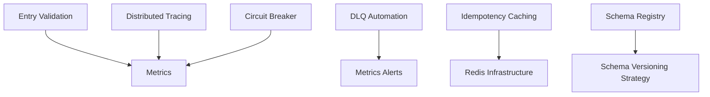

# PAGW Microservices - Remaining TODO Items

> **Generated:** December 20, 2025  
> **Status:** 3 Critical items completed, 7 items remaining

---

## ✅ Completed Items

| # | Item | Priority | Status |
|---|------|----------|--------|
| 1 | Attachment completion tracking | 🔴 Critical | ✅ Done |
| 2 | Outbox publisher HA | 🔴 Critical | ✅ Done |
| 3 | Sync timeout race condition | 🔴 Critical | ✅ Done |

---

## 🔲 Remaining Items

### 🟠 High Priority

#### 4. Distributed Tracing
**Effort:** Medium | **Risk if Not Done:** Debugging blind spots

**Current State:**
- `correlationId` and `pagwId` in MDC logging
- No actual distributed tracing integration

**Required Work:**
- [ ] Add OpenTelemetry or Micrometer Tracing dependencies to all services
- [ ] Configure trace propagation headers (`traceparent`, `tracestate`)
- [ ] Integrate with Jaeger/Zipkin/AWS X-Ray
- [ ] Add span annotations to key methods (`@Observed` or `@WithSpan`)
- [ ] Configure sampling rate for production

**Files to Modify:**
```
*/source/pom.xml                    # Add tracing dependencies
*/source/src/main/resources/*.yml   # Configure tracing endpoint
```

**Sample Dependency:**
```xml
<dependency>
    <groupId>io.micrometer</groupId>
    <artifactId>micrometer-tracing-bridge-otel</artifactId>
</dependency>
<dependency>
    <groupId>io.opentelemetry</groupId>
    <artifactId>opentelemetry-exporter-otlp</artifactId>
</dependency>
```

---

#### 5. Circuit Breaker
**Effort:** Low | **Risk if Not Done:** Cascading failures

**Current State:**
- Config placeholder exists in YAML
- DB has `circuit_breaker_enabled` column in payer config
- No Resilience4j implementation

**Required Work:**
- [ ] Add Resilience4j dependencies to services that make external calls
- [ ] Configure circuit breakers for:
  - External API calls (pasapiconnector)
  - Database connections
  - S3 operations
- [ ] Add fallback methods for graceful degradation
- [ ] Expose circuit breaker metrics via actuator

**Files to Modify:**
```
pasapiconnector/source/pom.xml
pasapiconnector/source/src/main/java/.../client/ExternalApiClient.java
pasrequestenricher/source/src/main/java/.../client/EligibilityClient.java
pasrequestenricher/source/src/main/java/.../client/ProviderDirectoryClient.java
```

**Sample Implementation:**
```java
@CircuitBreaker(name = "externalApi", fallbackMethod = "fallbackResponse")
public ApiResponse callExternalApi(String payload) {
    // ...
}

public ApiResponse fallbackResponse(String payload, Exception e) {
    return ApiResponse.builder()
        .status("SERVICE_UNAVAILABLE")
        .message("External service temporarily unavailable")
        .build();
}
```

---

#### 6. DLQ Automation
**Effort:** Medium | **Risk if Not Done:** Manual ops burden

**Current State:**
- DLQ runbook exists (manual procedures)
- DLQs configured in SQS
- No automated reprocessing

**Required Work:**
- [ ] Create DLQ processor service or Lambda
- [ ] Implement retry logic with exponential backoff
- [ ] Add dead letter reason classification
- [ ] Create operator dashboard/alerts for stuck messages
- [ ] Add automated reprocessing for transient errors
- [ ] Implement poison message quarantine

**New Files to Create:**
```
dlqprocessor/                       # New service or add to outboxpublisher
  source/src/main/java/.../
    service/DlqProcessorService.java
    model/DlqMessage.java
    classifier/ErrorClassifier.java
```

**Sample Error Classification:**
```java
public enum DlqAction {
    RETRY,           // Transient error - retry with backoff
    REQUEUE_FRONT,   // Data fixed - reprocess immediately  
    QUARANTINE,      // Poison message - move to quarantine
    ALERT_OPERATOR   // Needs manual intervention
}
```

---

#### 7. Entry Validation
**Effort:** Low | **Risk if Not Done:** Resource waste

**Current State:**
- BusinessValidatorService validates requests mid-pipeline
- No validation at API entry point

**Required Work:**
- [ ] Add request validation at pasorchestrator entry
- [ ] Validate FHIR Bundle structure before S3 storage
- [ ] Check required fields (resourceType, entry array)
- [ ] Validate content-type headers
- [ ] Return early with 400 Bad Request for invalid inputs

**Files to Modify:**
```
pasorchestrator/source/src/main/java/.../controller/OrchestratorController.java
pasorchestrator/source/src/main/java/.../service/OrchestratorService.java
```

**Sample Validation:**
```java
@PostMapping("/submit")
public ResponseEntity<?> submitRequest(
        @Valid @RequestBody PasRequest request,  // Add @Valid
        BindingResult result) {
    
    if (result.hasErrors()) {
        return ResponseEntity.badRequest()
            .body(buildOperationOutcome(result.getAllErrors()));
    }
    // ... proceed with processing
}
```

---

### 🟡 Medium Priority

#### 8. Schema Registry
**Effort:** High | **Risk if Not Done:** Breaking changes

**Current State:**
- Schema file at `docs/schemas/pagw_message.v1.json`
- No schema registry service
- No version enforcement

**Required Work:**
- [ ] Evaluate schema registry options (AWS Glue, Confluent, custom)
- [ ] Implement schema versioning strategy
- [ ] Add schema validation to message producers
- [ ] Add backward compatibility checks
- [ ] Create schema evolution guidelines

**Files to Create:**
```
docs/schemas/
  pagw_message.v2.json              # New versions
  SCHEMA_EVOLUTION.md               # Guidelines
  
pagwcore/source/src/main/java/.../
  schema/SchemaRegistry.java
  schema/SchemaValidator.java
```

---

#### 9. Metrics
**Effort:** Medium | **Risk if Not Done:** No visibility

**Current State:**
- Actuator endpoints exposed (health, info, metrics)
- No custom business metrics

**Required Work:**
- [ ] Add Micrometer custom metrics for:
  - Request throughput by type
  - Processing latency percentiles (p50, p95, p99)
  - Error rates by error code
  - Queue depths
  - Attachment processing times
- [ ] Create Grafana dashboards
- [ ] Set up CloudWatch alarms

**Files to Modify:**
```
*/source/pom.xml                    # Add micrometer-registry-cloudwatch
*/source/src/main/java/...          # Add @Timed annotations
*/source/src/main/resources/*.yml   # Configure metrics export
```

**Sample Metrics:**
```java
@Service
public class MetricsService {
    private final MeterRegistry registry;
    
    public void recordRequestLatency(String requestType, long durationMs) {
        Timer.builder("pagw.request.latency")
            .tag("type", requestType)
            .register(registry)
            .record(Duration.ofMillis(durationMs));
    }
    
    public void incrementErrorCount(String errorCode) {
        registry.counter("pagw.errors", "code", errorCode).increment();
    }
}
```

---

#### 10. Idempotency Caching
**Effort:** Low | **Risk if Not Done:** Duplicate work

**Current State:**
- `idempotency-table` config exists
- DB migration for idempotency table exists
- No Redis/ElastiCache caching layer

**Required Work:**
- [ ] Add Redis/ElastiCache client to pagwcore
- [ ] Implement cache-aside pattern for idempotency checks
- [ ] Configure TTL for idempotency keys
- [ ] Add cache invalidation on completion
- [ ] Fallback to DB when cache unavailable

**Files to Modify:**
```
pagwcore/source/pom.xml             # Add spring-data-redis
pagwcore/source/src/main/java/.../
  service/IdempotencyService.java   # Add caching layer
  config/RedisConfig.java           # New config
```

**Sample Implementation:**
```java
@Service
public class CachedIdempotencyService implements IdempotencyService {
    
    private final RedisTemplate<String, String> redis;
    private final JdbcTemplate jdbc;
    
    public boolean checkAndSet(String key) {
        // Try cache first
        Boolean cached = redis.opsForValue()
            .setIfAbsent("idempotency:" + key, "1", Duration.ofHours(24));
        
        if (cached != null && cached) {
            // Also write to DB for durability
            persistToDb(key);
            return true;
        }
        return false;
    }
}
```

---

## Priority Matrix

```
                    EFFORT
              Low         High
         ┌─────────┬─────────┐
    High │ 5,7     │ 4,6     │  ← Do First
IMPACT   ├─────────┼─────────┤
    Med  │ 10      │ 8,9     │  ← Do Second
         └─────────┴─────────┘
```

**Recommended Order:**
1. **Circuit Breaker (5)** - Low effort, prevents cascading failures
2. **Entry Validation (7)** - Low effort, reduces wasted processing
3. **Distributed Tracing (4)** - Essential for debugging
4. **DLQ Automation (6)** - Reduces operational burden
5. **Idempotency Caching (10)** - Performance improvement
6. **Metrics (9)** - Observability
7. **Schema Registry (8)** - Long-term maintainability

---

## Dependencies



---

## Notes

- All items should be implemented in `pagwcore` shared library where applicable
- Test in dev environment before promoting to SIT/preprod
- Update Helm values files after adding new configuration
- Coordinate with DevOps for infrastructure (Redis, Jaeger, etc.)
