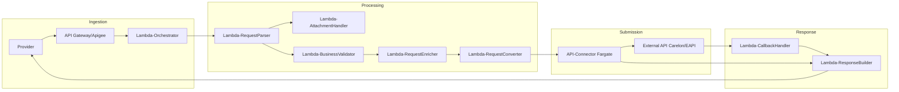
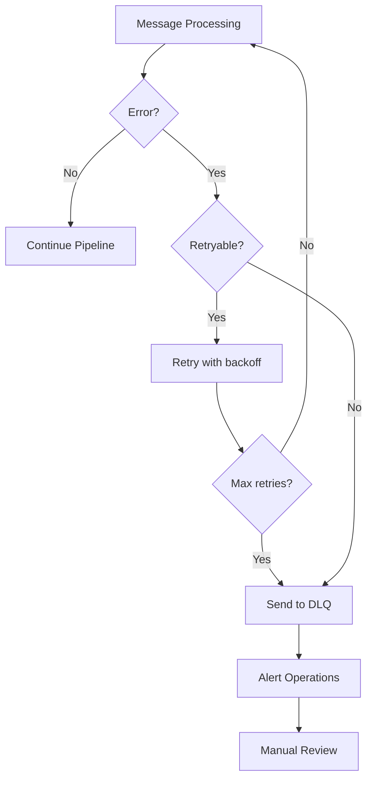
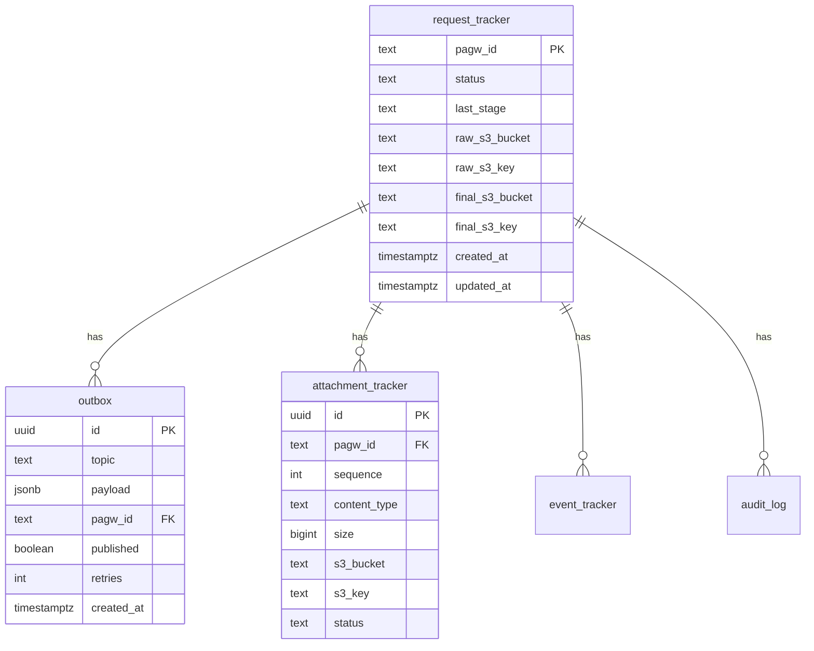

# PAGW Sequence Diagram

## Complete Request Processing Flow

```mermaid
sequenceDiagram
    autonumber
    participant Provider as Provider System
    participant APIGW as API Gateway / Apigee
    participant Auth as Lambda-ProviderAuth
    participant Orch as Lambda-Orchestrator
    participant S3 as S3 (raw/enriched/artifacts)
    participant RDS as Aurora (RDS Proxy)
    participant Parser as Lambda-RequestParser
    participant Attach as Lambda-AttachmentHandler
    participant Valid as Lambda-BusinessValidator
    participant Enrich as Lambda-RequestEnricher
    participant Convert as Lambda-RequestConverter
    participant Connector as API-Connector (Fargate)
    participant Resp as Lambda-ResponseBuilder
    participant Callback as Lambda-CallbackHandler
    participant Outbox as Outbox Publisher
    participant SQS as SQS Queues
    participant External as External Claims API (Carelon/EAPI)

    Note over Provider, External: PHASE 1: Authentication & Request Ingestion

    Provider->>+APIGW: POST /Claim (FHIR Bundle) + Authorization: Bearer <token>
    APIGW->>+Auth: Validate Token (Lambda Authorizer)
    Auth->>RDS: Lookup provider_registry (client_id)
    Auth->>Auth: Verify permissions for /Claim
    Auth-->>-APIGW: IAM Policy (Allow) + Provider Context
    
    APIGW->>+Orch: Forward Request + Provider Context (tenant, clientId, npi)
    
    Orch->>Orch: Generate pagwId
    Orch->>Orch: Encrypt PHI Fields (AES-256-GCM)
    Orch->>S3: Store raw bundle (pagw/pas/{pagwId}/raw.json)
    Orch->>RDS: INSERT request_tracker (RECEIVED, tenant, clientId)
    Orch->>RDS: INSERT outbox (pagw-queue-request-parser)
    Orch-->>-APIGW: ClaimResponse (status=queued)
    APIGW-->>-Provider: 200 OK + ACK

    Note over Outbox, SQS: PHASE 2: Async Processing Begins

    loop Every 30 seconds
        Outbox->>RDS: SELECT unpublished FROM outbox FOR UPDATE SKIP LOCKED
        Outbox->>SQS: Publish messages
        Outbox->>RDS: UPDATE outbox SET published=true
    end

    Note over Parser, Valid: PHASE 3: Parsing & Validation

    SQS->>+Parser: pagw-queue-request-parser
    Parser->>S3: GET raw bundle
    Parser->>Parser: Parse FHIR Bundle
    Parser->>Parser: Extract attachments
    Parser->>S3: Store parsed data
    Parser->>RDS: UPDATE request_tracker (PARSING)
    
    par Parallel Processing
        Parser->>RDS: INSERT outbox (pagw-queue-business-validator) [main flow]
    and If Attachments Exist
        Parser->>RDS: INSERT outbox (pagw-queue-attachment-handler) [parallel]
    end
    Parser-->>-SQS: ACK

    opt Parallel: Attachment Processing
        SQS->>+Attach: pagw-queue-attachment-handler
        Attach->>S3: GET parsed data
        Attach->>Attach: Validate content types
        Attach->>Attach: Check file sizes
        Attach->>S3: Store attachments (pagw-attachments)
        Attach->>RDS: INSERT attachment_tracker
        Attach->>RDS: UPDATE request_tracker (ATTACHMENTS_PROCESSED)
        Note over Attach: Parallel path ends here (no next queue)
        Attach-->>-SQS: ACK
    end

    SQS->>+Valid: pagw-queue-business-validator
    Valid->>S3: GET parsed data
    Valid->>Valid: Run validation rules
    Valid->>Valid: Check NPI
    Valid->>Valid: Validate insurance
    alt Validation Failed
        Valid->>RDS: UPDATE request_tracker (VALIDATION_FAILED)
        Valid->>RDS: INSERT outbox (pagw-queue-response-builder) [error]
    else Validation Passed
        Valid->>S3: Store validation result
        Valid->>RDS: INSERT outbox (pagw-queue-request-enricher)
    end
    Valid-->>-SQS: ACK

    Note over Enrich, Convert: PHASE 4: Enrichment & Conversion

    SQS->>+Enrich: pagw-queue-request-enricher
    Enrich->>S3: GET validated data
    Enrich->>External: GET eligibility (member lookup)
    Enrich->>External: GET provider info (NPI lookup)
    Enrich->>Enrich: Merge enrichment data
    Enrich->>S3: Store enriched data
    Enrich->>RDS: INSERT outbox (pagw-queue-request-converter)
    Enrich-->>-SQS: ACK

    SQS->>+Convert: pagw-queue-request-converter
    Convert->>S3: GET enriched data
    Convert->>Convert: Create per-target payloads
    Convert->>Convert: Determine target system
    Convert->>S3: Store converted data
    Convert->>RDS: INSERT outbox (pagw-queue-api-connectors)
    Convert-->>-SQS: ACK

    Note over Connector, External: PHASE 5: Downstream Submission

    SQS->>+Connector: pagw-queue-api-connectors
    Connector->>S3: GET converted data
    Connector->>External: POST claim to target system (Carelon/EAPI)
    External-->>Connector: Response (sync or async)
    Connector->>S3: Store API response (s3/pagw/{pagwId}/events/)
    Connector->>RDS: UPDATE event_tracker
    Connector->>RDS: INSERT outbox (pagw-queue-callback-handler)
    Note over Connector: Always routes to callback-handler (per target arch)
    Connector-->>-SQS: ACK

    Note over Callback, Resp: PHASE 6: Response Generation

    SQS->>+Callback: pagw-queue-callback-handler
    Callback->>RDS: Lookup by external reference
    Callback->>Callback: Normalize response (sync or async)
    Callback->>S3: Store callback result
        Callback->>RDS: INSERT outbox (pagw-queue-response-builder)
        Callback-->>-External: 200 OK
    end

    SQS->>+Resp: pagw-queue-response-builder
    Resp->>S3: GET response data
    Resp->>Resp: Build FHIR ClaimResponse
    Resp->>S3: Store final response (s3/pagw/{pagwId}/final.json)
    Resp->>RDS: UPDATE request_tracker (COMPLETED)
    Resp->>Provider: Push final Callback (if subscription) / notify status
    Resp-->>-SQS: ACK
```

## Simplified Flow Diagram



Note: Parser sends to both BusinessValidator (main flow) AND AttachmentHandler (parallel, only if attachments exist).

## Error Handling Flow



## Data Flow Stages

All data for a single request is stored under ONE folder: `{YYYYMM}/{pagwId}/`

This structure enables:
- Single folder to view entire request lifecycle
- Easy retention/cleanup (delete one folder per request)
- Fewer S3 LIST operations for debugging
- Compliance audit trail in one location

| Stage | Queue | Input | Output | S3 Path |
|-------|-------|-------|--------|---------|
| 1. Ingestion | - | FHIR Bundle | pagwId + ACK | `{YYYYMM}/{pagwId}/request/raw.json` |
| 2. Parsing | request-parser | Raw bundle | Parsed data | `{YYYYMM}/{pagwId}/request/parsed.json` |
| 3. Attachments | attachment-handler | Parsed data | Attachment metadata | `{YYYYMM}/{pagwId}/attachments/meta.json` |
| 4. Validation | business-validator | Parsed data | Validation result | `{YYYYMM}/{pagwId}/request/validated.json` |
| 5. Enrichment | request-enricher | Validated data | Enriched data | `{YYYYMM}/{pagwId}/request/enriched.json` |
| 6. Conversion | request-converter | Enriched data | Target format (X12 278) | `{YYYYMM}/{pagwId}/request/canonical.json` |
| 7. Submission | api-connectors | Converted data | Payer API response | `{YYYYMM}/{pagwId}/response/payer_raw.json` |
| 8. Callback | callback-handler | Payer response | Normalized result | `{YYYYMM}/{pagwId}/response/callback.json` |
| 9. Response | response-builder | Callback result | FHIR ClaimResponse | `{YYYYMM}/{pagwId}/response/fhir.json` |

## Database Tables


